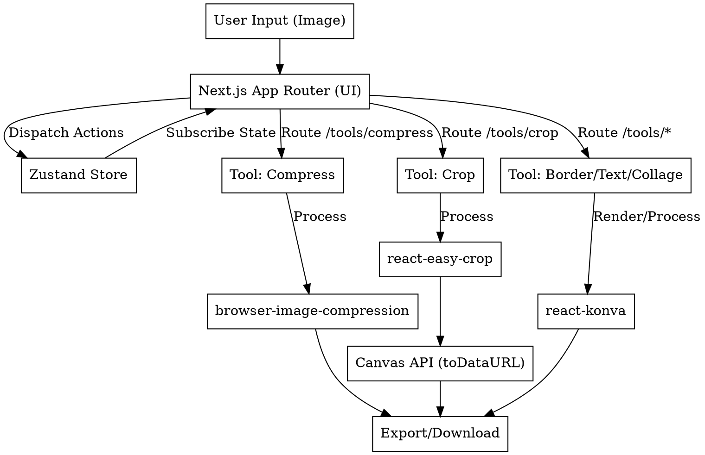

# Image Tools Platform Design Spec

## Why
Users need a high-performance, privacy-focused image editing platform for various social media and content creation scenarios. Existing tools often require server uploads (compromising privacy and speed) or lack quick, scenario-based presets (like "Xiaohongshu cover" or "WeChat Official Account header"). This project aims to build a pure client-side toolset that prioritizes "Scenario Presets First, General Configuration as Fallback."

## What Changes
- **Core Framework**: Next.js 14+ (App Router) for high performance and SEO.
- **UI/Interaction**: Tailwind CSS + shadcn/ui + Lucide Icons for a modern, responsive design.
- **State Management**: Zustand for managing canvas state and history (undo/redo).
- **Processing Mode**: 100% pure client-side processing (browser-based) to ensure privacy and eliminate server bandwidth costs.
- **Tool-Specific Engines**:
  - **Compression**: `browser-image-compression` (Web Worker support, prevents UI blocking).
  - **Cropping**: `react-easy-crop` (modern interaction, mobile-friendly, built-in grid).
  - **Canvas Manipulation (Border, Text, Collage)**: `react-konva` (React-friendly, high performance layer management).
- **Layout Strategies**:
  - **Standard (Left-Right)**: 65% immersive preview, 35% configuration panel (Presets Tab + General Config).
  - **Collage (Left-Center-Right)**: Template library, Preview area, Attribute settings.
- **Interaction Logic**: Selecting a scenario preset automatically updates general parameters. Manually modifying general parameters deselects the preset (switching to "Custom" mode).

## Architecture & Data Flow

## Features Detailed

### 1. Home (/) - Scenario Navigation
- Grid of scenario cards (Xiaohongshu, WeChat Official Account, E-commerce, etc.).
- Click navigates to specific tool with URL parameters (e.g., `?type=xiaohongshu`).

### 2. Image Compression (/tools/compress)
- **Preview**: Original vs. Compressed slider, size comparison, estimated load time.
- **Presets**: WeChat (JPG, 80%, strip metadata), Xiaohongshu (WebP, 70%), Print (Lossless).
- **General Config**: Quality slider (0-100%), Scale (px), Format (JPG/PNG/WebP/AVIF).

### 3. Image Cropping (/tools/crop)
- **Preview**: Rule of thirds grid, draggable image/crop box.
- **Presets**: Xiaohongshu (3:4), WeChat Header (2.35:1), TikTok (9:16), Avatar (1:1).
- **General Config**: Free crop, exact px input, rotation (90°), flip (H/V).

### 4. Add Border (/tools/border)
- **Preview**: Real-time rendering via Konva.
- **Presets**: Polaroid (white bg, wide bottom), Minimalist (1px stroke), Morandi (wide padding + soft color), Cinematic (black bars).
- **General Config**: Border width (unified/individual), Color picker, Border radius (0-50px).

### 5. Add Text (/tools/text)
- **Preview**: Draggable, scalable, rotatable text blocks via Konva.
- **Presets**: Quote (centered, serif, quotes), Video Title (large, highlight bg, stroke), Watermark (bottom-right, semi-transparent), Badge (top-right, rounded bg).
- **General Config**: Text input, Font family, Style (size, color, spacing, line height), Effects (stroke, shadow, background block).

### 6. Image Collage (/tools/collage)
- **Layout**: Left (Templates), Center (Preview), Right (Settings).
- **Templates**: Comparison, Multi-image, Irregular.
- **Preview**: Drag to swap images, upload background image.
- **Presets**: Xiaohongshu style (white gap, rounded, beige bg), Comparison (1:1 with VS icon), Grid (3x3, no gap).
- **General Config**: Gap (0-50px), Border radius, Object fit (Fill/Fit).

## Impact
- **Affected files**: New Next.js project structure, routing, Zustand store setup, specialized tool components.
- **Performance**: Zero server-side image processing costs. High client-side performance leveraging Web Workers and Konva.

## ADDED Requirements
### Requirement: Scenario-Driven Configuration
The system SHALL prioritize scenario-based presets while allowing granular control.
#### Scenario: Selecting a Preset
- **WHEN** user selects "Xiaohongshu Cover" in the Crop tool
- **THEN** the crop ratio is locked to 3:4, and the general configuration panel reflects these values.
#### Scenario: Custom Override
- **WHEN** user modifies the width/height manually after selecting a preset
- **THEN** the preset selection is cleared (switches to "Custom"), but the new values are applied.
